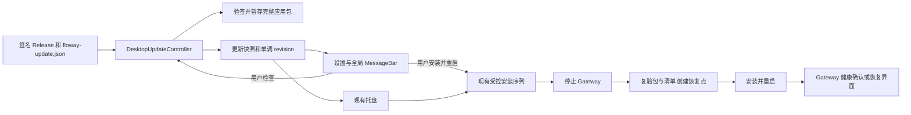

# Floway 桌面应用更新交互调研

调研日期：2026-10-02。范围：当前 Floway 更新链路、Lody 源码中的更新交互、Tauri v2 更新边界、Fluent UI React v9 的组件用法。本次为调研，不包含生产实现。

**建议补齐现有更新功能的应用内体验。** Floway 已有 Tauri 原生检测、签名校验、暂存、受控安装与恢复点；当前主入口在托盘，Dashboard 设置只有版本和日志。新增功能应由同一个 Rust controller 驱动设置页、全局提醒和托盘，保留后台下载，由用户决定安装重启。

完整交付还需要发布端：调查时 Floway 仓库的 Releases 列表为空，清单正文生成器也只写版本标题。UI、原生状态桥、带正文的签名 Release 三者需要一起形成闭环。以下第 6–10 节给出本仓库证据、具体 UX 和实施顺序。

## 1. 证据范围

Lody 固定在提交 [`194c1aaf92a07848be2b5162ddf733d3d5674998`](https://github.com/LodyAI/Lody/commit/194c1aaf92a07848be2b5162ddf733d3d5674998)（提交时间 2026-10-01 23:50:23 +08:00）。以下“呈现”“入口”均来自组件、状态转换和调用路径的源码阅读，**没有运行 Lody，也没有观察其真实渲染界面、截图或线上更新过程**。因此可以确认设计意图与代码条件，不能确认发布版的实际尺寸、动画、焦点或操作结果。

Tauri 除当前官方文档外，核对了 Floway 本地依赖 `tauri-plugin-updater 2.12.0` 的发布源码；其 `.cargo_vcs_info.json` 固定到 [`5baf71a47292d8490f0ba3d53f15224e55c48327`](https://github.com/tauri-apps/plugins-workspace/tree/5baf71a47292d8490f0ba3d53f15224e55c48327/plugins/updater)。Fluent 来源为 Microsoft 官方 Fluent 2 React 使用指南，其 Web 概览明确链接 React v9 Storybook；指南属于设计约束，不表示 Floway 已安装或导出了全部候选组件。[Fluent React 概览](https://fluent2.microsoft.design/components/web/react)

## 2. Lody：可借鉴的是状态与入口

### 2.1 实际状态与更新引擎

共享状态枚举只有 `idle`、`checking`、`downloading`、`downloaded`、`up_to_date`、`error`、`disabled`。可用版本、已下载版本、发布说明、日期、进度、字节数、检查时间、错误是附加字段；**没有独立的 available、verifying、installing、installed 状态**。界面的“正在重启”由组件局部布尔值表示，不是全局更新阶段。[共享类型](https://github.com/LodyAI/Lody/blob/194c1aaf92a07848be2b5162ddf733d3d5674998/packages/shared/src/electron-ipc.ts#L439-L483)、[侧栏安装处理](https://github.com/LodyAI/Lody/blob/194c1aaf92a07848be2b5162ddf733d3d5674998/packages/components/src/components/loro-app-sidebar.tsx#L3183-L3200)

| 场景 | 源码行为 | 对交互的含义 |
| --- | --- | --- |
| Electron 更新路径启动 | 启动检查，之后每 30 分钟检查；自动下载，关闭自动退出时安装 | 用户不必确认下载；重启安装由用户触发 |
| Electron 发现新版本 | `update-available` 直接变成 `downloading`，清除旧下载文件引用 | 不存在停留等待确认的“有更新”阶段 |
| Electron 下载完成 | 写入 `downloaded` 和版本、发布说明等 | 此时侧栏才出现重启操作 |
| macOS 打包应用 | 优先加载 Sparkle 桥，启用自动检查；加载失败才进入 Electron 路径 | 30 分钟检查与 Electron 配置不能笼统归于 macOS Sparkle |
| Sparkle 事件 | 桥接事件映射为共享状态，`update-available` 同样映为 `downloading` | 此映射不单独证明 Sparkle 原生提示的视觉与确认行为 |
| 未启用 | 写入 `disabled` | 更新 UI 可以完全隐藏；原因文案不能据此断定所有 disabled 都是开发模式 |

来源：[服务启动与检查](https://github.com/LodyAI/Lody/blob/194c1aaf92a07848be2b5162ddf733d3d5674998/apps/electron/src/main/services/app-updater-service.ts#L30-L208)、[Electron 事件](https://github.com/LodyAI/Lody/blob/194c1aaf92a07848be2b5162ddf733d3d5674998/apps/electron/src/main/services/app-updater-service.ts#L431-L507)、[Sparkle 策略](https://github.com/LodyAI/Lody/blob/194c1aaf92a07848be2b5162ddf733d3d5674998/apps/electron/src/main/services/app-updater-sparkle-policy.ts#L14-L35)、[Sparkle 状态映射](https://github.com/LodyAI/Lody/blob/194c1aaf92a07848be2b5162ddf733d3d5674998/apps/electron/src/main/services/app-updater-sparkle-events.ts#L31-L107)。

**发布能力的限制**：当前公共构建为 local-only，`localPlatform` 默认禁用 updater，除非显式覆盖。当前 README 说明 release workflow 不构建或上传安装包和自动更新文件。因此这里调研的是保留在代码中的更新体验，不能称为“当前开源版已验证可用的更新流程”。[构造启用条件](https://github.com/LodyAI/Lody/blob/194c1aaf92a07848be2b5162ddf733d3d5674998/apps/electron/src/main/application.ts#L224-L229)、[公共构建说明](https://github.com/LodyAI/Lody/blob/194c1aaf92a07848be2b5162ddf733d3d5674998/apps/electron/README.md#L109-L122)、[发布说明](https://github.com/LodyAI/Lody/blob/194c1aaf92a07848be2b5162ddf733d3d5674998/README.md#L148-L159)

### 2.2 三个入口

| 入口 | 显示内容与操作 | 源码 |
| --- | --- | --- |
| 主侧栏底部浮层 | 仅 `downloading` / `downloaded` 且目标版本存在时显示。下载中显示后台下载文案、已知百分比、查看变更、稍后；下载完成显示更新已就绪、目标版本、查看变更、稍后、更新并重启 | [筛选模型](https://github.com/LodyAI/Lody/blob/194c1aaf92a07848be2b5162ddf733d3d5674998/packages/components/src/lib/electron-update-banner.ts#L1-L46)、[Banner 组件](https://github.com/LodyAI/Lody/blob/194c1aaf92a07848be2b5162ddf733d3d5674998/packages/components/src/components/sidebar-update-banner.tsx#L13-L79)、[挂载位置](https://github.com/LodyAI/Lody/blob/194c1aaf92a07848be2b5162ddf733d3d5674998/packages/components/src/components/loro-app-sidebar.tsx#L3248-L3275) |
| 设置 → 关于 | 当前运行版本与构建信息、检查更新；检查中禁用按钮并显示 Spinner；下载中禁用检查并显示百分比；已下载则改成更新并重启；安装期间禁用按钮 | [关于页面](https://github.com/LodyAI/Lody/blob/194c1aaf92a07848be2b5162ddf733d3d5674998/packages/components/src/components/settings/about-setting.tsx#L261-L389) |
| 原生菜单 | macOS 应用菜单、其他桌面系统菜单都有检查更新；主进程开始检查，同时向渲染器发菜单事件打开关于设置 | [菜单](https://github.com/LodyAI/Lody/blob/194c1aaf92a07848be2b5162ddf733d3d5674998/apps/electron/src/main/menu.ts#L85-L160)、[事件映射](https://github.com/LodyAI/Lody/blob/194c1aaf92a07848be2b5162ddf733d3d5674998/packages/components/src/components/electron-menu-handler.tsx#L25-L55) |

主进程持有状态；IPC 提供 `getState`、`checkForUpdates`、`quitAndInstall` 三个动作。每次修改状态向所有存活窗口推送快照。React hook 首次读取快照并订阅事件，纯 Web 没有 Electron 标记时返回空状态。这个“宿主拥有状态、UI 映射快照”的边界比 Electron API 本身更值得迁移。[IPC 服务](https://github.com/LodyAI/Lody/blob/194c1aaf92a07848be2b5162ddf733d3d5674998/apps/electron/src/main/ipc/services/updater-ipc.ts#L4-L21)、[状态广播](https://github.com/LodyAI/Lody/blob/194c1aaf92a07848be2b5162ddf733d3d5674998/apps/electron/src/main/services/app-updater-service.ts#L508-L525)、[Hook](https://github.com/LodyAI/Lody/blob/194c1aaf92a07848be2b5162ddf733d3d5674998/packages/components/src/hooks/use-electron-updater-state.ts#L5-L32)

### 2.3 稍后、重启与错误

“稍后”有两种生命周期：下载中的隐藏只存在于当前组件内存，不停止下载，完成后就绪提示重新出现；已下载提示按版本写入 `localStorage`，同版本跨页面重载仍隐藏，新版本重新提示。设置里的安装入口独立于这条隐藏规则。[隐藏状态初始化](https://github.com/LodyAI/Lody/blob/194c1aaf92a07848be2b5162ddf733d3d5674998/packages/components/src/components/loro-app-sidebar.tsx#L1658-L1674)、[隐藏操作](https://github.com/LodyAI/Lody/blob/194c1aaf92a07848be2b5162ddf733d3d5674998/packages/components/src/components/loro-app-sidebar.tsx#L3165-L3177)、[显示条件](https://github.com/LodyAI/Lody/blob/194c1aaf92a07848be2b5162ddf733d3d5674998/packages/components/src/components/loro-app-sidebar.tsx#L3248-L3266)

Electron 非 Sparkle 路径只在 `downloaded` 时安装。失败时若下载文件还存在，保留 `downloaded`，附带错误，让就绪提示与重试入口继续可见；Linux deb 安装另外以 `installInFlight` 防止重复调用，成功后才 relaunch/quit。Sparkle 的 `error` 映射则直接进入 `error`，没有相同的保留逻辑，不能把 Electron 分支的保证外推到所有平台。[安装与结果](https://github.com/LodyAI/Lody/blob/194c1aaf92a07848be2b5162ddf733d3d5674998/apps/electron/src/main/services/app-updater-service.ts#L217-L289)、[Linux 与错误保留](https://github.com/LodyAI/Lody/blob/194c1aaf92a07848be2b5162ddf733d3d5674998/apps/electron/src/main/services/app-updater-service.ts#L290-L338)、[Sparkle 错误](https://github.com/LodyAI/Lody/blob/194c1aaf92a07848be2b5162ddf733d3d5674998/apps/electron/src/main/services/app-updater-sparkle-events.ts#L95-L103)

侧栏安装失败弹出错误 Toast；关于页面对一般错误显示概括文案，对 `downloaded + error` 附带原始错误的 title，并继续显示安装按钮。侧栏重启按钮仅通过 Spinner 表示调用中，组件自身没有 disabled 条件；Floway 设计需要以自己的并发约束为准，不能认为所有 Lody 入口已阻止重复调用。[侧栏错误](https://github.com/LodyAI/Lody/blob/194c1aaf92a07848be2b5162ddf733d3d5674998/packages/components/src/components/loro-app-sidebar.tsx#L3183-L3200)、[关于错误与按钮](https://github.com/LodyAI/Lody/blob/194c1aaf92a07848be2b5162ddf733d3d5674998/packages/components/src/components/settings/about-setting.tsx#L344-L386)、[侧栏按钮](https://github.com/LodyAI/Lody/blob/194c1aaf92a07848be2b5162ddf733d3d5674998/packages/components/src/components/sidebar-update-banner.tsx#L66-L75)

可见的 `AppUpdaterService.state` 是进程内存；`downloadedFile` 引用也在内存。这里确认了提示隐藏持久化，**没有证据证明 Lody 自己将完整更新状态和恢复点持久化**；Electron/Sparkle 的缓存持久性属于底层实现，不能从此服务推导可靠的跨重启恢复协议。[服务字段](https://github.com/LodyAI/Lody/blob/194c1aaf92a07848be2b5162ddf733d3d5674998/apps/electron/src/main/services/app-updater-service.ts#L81-L94)

### 2.4 变更说明

下载中和就绪状态都允许主动点击查看变更；不会自动打开浏览器。应用内 Dialog 以版本为标题，日期可选，正文可滚动，Markdown 明确 `allowHtml=false`。没有正文时显示缺失说明，并提供外部变更页兜底。源码设置面板宽度 576px、正文上限 50vh；这些是实现值，尚未通过实际渲染核对。[变更 Dialog](https://github.com/LodyAI/Lody/blob/194c1aaf92a07848be2b5162ddf733d3d5674998/packages/components/src/components/update-changelog-dialog.tsx#L10-L105)

本地化选择按 UI 的 resolvedLanguage，优先当前语言，再英文，再通用 `releaseNotes`。主进程只接受 `vendor.lodyChangelog.contentVersion` 与目标版本完全一致的本地化元数据，并限制字符串长度为 64KiB；Sparkle 状态映射不提供同样的 locale map。[语言回退](https://github.com/LodyAI/Lody/blob/194c1aaf92a07848be2b5162ddf733d3d5674998/packages/components/src/lib/electron-update-banner.ts#L48-L69)、[元数据读取](https://github.com/LodyAI/Lody/blob/194c1aaf92a07848be2b5162ddf733d3d5674998/apps/electron/src/main/services/app-updater-metadata.ts#L3-L68)、[Sparkle 字段](https://github.com/LodyAI/Lody/blob/194c1aaf92a07848be2b5162ddf733d3d5674998/apps/electron/src/main/services/app-updater-sparkle-events.ts#L51-L66)

## 3. Tauri v2：应转移模式，保留 Floway 的宿主控制

Tauri 更新插件支持检查、下载、安装的分离，更新签名不可关闭；Windows 安装步骤会退出应用，macOS/Linux 安装新版本后需要重启才运行新版本。官方建议可以通过 Rust command/channel 向前端传下载进度，并自行决定提示时机。[官方 Updater 指南](https://v2.tauri.app/plugin/updater/)

`check()` 返回 `Update | null`；元数据包括 currentVersion/version、可选 body/date、rawJson。下载事件只有 Started（contentLength 可缺省）、Progress（chunkLength）、Finished；缺失总量时不得伪造百分比。JS `Update` 持有 Rust resource，`close()` 释放资源和下载字节，它本身不等于持久化的 staged 包。[官方 JS API](https://v2.tauri.app/reference/javascript/updater/)

**关键状态边界**：Floway 所用 2.12.0 的 Rust `download()` 在流读取完成后先调用 `on_download_finish()`，随后才 `verify_signature()`，最后返回成功字节。因此 `Finished` 或下载 100% 只能说明传输结束，不能直接显示“可以安装”；必须等验证与 Floway 自身 staging 成功。`download_and_install()` 则直接调用 download→install，不能承载 Floway 已有的停止网关、恢复点、重新校验和恢复流程。[2.12.0 下载与安装源码](https://github.com/tauri-apps/plugins-workspace/blob/5baf71a47292d8490f0ba3d53f15224e55c48327/plugins/updater/src/updater.rs#L676-L773)

研究推论：沿用 Lody 的“后台下载、持续可找的就绪提示、用户决定重启、设置里完整状态”的产品模式；接入 Floway 现有 Rust controller，把快照/进度/动作暴露给 Dashboard。不要另开直接调用 JS `downloadAndInstall()` 的更新路径。多语言说明可借鉴 Lody 按版本绑定与英文回退，但需由 Floway 发布 manifest 或独立 release metadata 提供正文；Tauri 可选 body 不是自动生成的变更说明。

## 4. Fluent UI v9：可用的表达方式

以下是根据官方组件用途提出的映射，不是已实现或已观察的 Floway UI。

| 交互任务 | 候选表达 | 官方约束与设计推论 |
| --- | --- | --- |
| 可安装提示 | 持续 Info MessageBar + 更新并重启 / 稍后 / 查看变更 | 官方将 app updates 列为 info 场景；MessageBar 支持动作和关闭。全局 MessageBar 应放在内容区命令栏下，不应放在侧栏上方。因此迁移 Lody 的提示层级，不直接复制浮层位置。[MessageBar 指南](https://fluent2.microsoft.design/components/web/react/core/messagebar/usage) |
| 设置中的检查 | Button + 带文字 Spinner | Spinner 表示处理中，不显示完成比例；只影响更新行，不阻塞整个设置页。[Spinner 指南](https://fluent2.microsoft.design/components/web/react/core/spinner/usage) |
| 后台下载 | ProgressBar + 已下载字节 / 百分比 | 已知总量用 determinate；未知总量用 indeterminate，之后有数据可切换；避免虚构时间。下载、验证、安装如果无完整加权模型，应明确阶段，不能把同一个“总进度”从 100% 回退到 0%。[ProgressBar 指南](https://fluent2.microsoft.design/components/web/react/core/progressbar/usage) |
| 变更详情 | 用户主动打开普通 Dialog，标题包含版本，正文滚动 | Dialog 是补充表面；普通更新不默认升级成 alert。Alert 适用于潜在损失。关闭后焦点应回到触发控件，至少保留明确关闭操作。[Dialog 指南](https://fluent2.microsoft.design/components/web/react/core/dialog/usage) |
| 手动检查结果 | 设置行内显示“已是最新”；可加短 Toast | Toast 是暂时反馈，不应成为必要动作的唯一入口；关键失败应留在持续可找的表面。若用进度 Toast，不同时放 Spinner 和 ProgressBar。[Toast 指南](https://fluent2.microsoft.design/components/web/react/core/toast/usage) |
| 失败与重试 | 设置行内错误摘要、详情和重试；必要时 MessageBar | 官方 warning/error MessageBar 需要可解决问题的按钮或链接。安装失败且包仍有效时，应该保留重试，而不因一次错误隐藏就绪入口。[MessageBar 指南](https://fluent2.microsoft.design/components/web/react/core/messagebar/usage)、[Lody 的错误保留](https://github.com/LodyAI/Lody/blob/194c1aaf92a07848be2b5162ddf733d3d5674998/apps/electron/src/main/services/app-updater-service.ts#L325-L338) |

## 5. 待补证据

本次没有观察 Lody/Sparkle 的实际渲染及原生对话框，也没有安装签名包来验证跨重启行为；上述结论限于固定提交源码。第 6 节补充了 Floway 本仓库的宿主状态、Dashboard 与发布流水线调查。仍未在本次调研安装两个真实发布版本或运行新 UI，不能把“组件代码存在”当作“发布更新已可达”。

## 6. Floway 当前已有能力与缺口

本仓库调查固定在 [`640293759439ffda530e41ef101ade60a5828cde`](https://github.com/tommy0103/Floway-One/commit/640293759439ffda530e41ef101ade60a5828cde)。源码范围与原有产品要求均已核对；下面的“已有”表示代码及既有测试路径存在，不表示本次重新运行了完整桌面验证。

| 层 | 已有行为 | 为本次功能需要补齐的部分 |
| --- | --- | --- |
| 更新引擎 | `tauri-plugin-updater = 2.12.0`，公钥由应用配置固定，stable 指向本仓库 `floway-update.json`；preview 有独立地址 | 保留同一引擎与受信任地址、公钥；preview 发布没有形成闭环时不增加可误选的产品入口 |
| 检测与下载 | packaged app 的 Gateway ready 后发起检查，发现更新立即下载、验签、暂存；dev shell 不暂存 | 手动检查入口、原生周期检查、单次操作并发约束，以及可供 UI 订阅的运行状态 |
| 状态 | 持久化 staged、pending health、failure、last healthy version；staged 内已有 notes | UI 快照缺少 checking、下载字节、校验阶段、最近检查时间、发布说明；目前只有 stagedVersion 等概要 |
| 主入口 | 托盘存在“安装 Floway {version} 并重启”；没有暂存包时禁用，失败时有上一版本下载入口 | 用户在 Dashboard 内可以发现更新、看详情和主动重启；设置中一直有手动检查入口 |
| 原生桥 | `desktop_runtime_status` 可返回概要；现有 `floway-desktop-status` 驱动启动/恢复界面 | 没有专用检查、安装 command；更新日志事件目前写 stderr，下载结束只刷新托盘，不会给 Dashboard 持续推送下载状态 |
| 受控安装 | 先停止 sidecar，再重新认证磁盘包、创建受设备密钥保护的恢复点、重新校验清单、安装、重启；新版本 runtime ready 才标记 healthy | 新 UI 的安装动作复用同一路径，展示更新阶段和失败重试，不能让 UI 直接替换文件 |
| 设置页 | 桌面能力下显示运行版本，Tauri 窗口提供日志按钮 | 在现有桌面 Panel 增加“应用更新”操作区，不需要另造一套设置导航 |
| 发布 | tag `v*` 流水线构建 macOS arm64/x64，打包验证后汇总 updater 包、签名和双平台清单 | 确保至少一个新版本真实发布并可下载；清单携带用户能读懂的变更正文 |

来源：[依赖](https://github.com/tommy0103/Floway-One/blob/640293759439ffda530e41ef101ade60a5828cde/apps/desktop/src-tauri/Cargo.toml#L101-L106)、[通道](https://github.com/tommy0103/Floway-One/blob/640293759439ffda530e41ef101ade60a5828cde/apps/desktop/src-tauri/src/update_channel.rs#L16-L50)、[原生检测与暂存](https://github.com/tommy0103/Floway-One/blob/640293759439ffda530e41ef101ade60a5828cde/apps/desktop/src-tauri/src/update_controller.rs#L332-L560)、[快照](https://github.com/tommy0103/Floway-One/blob/640293759439ffda530e41ef101ade60a5828cde/apps/desktop/src-tauri/src/update_controller.rs#L257-L292)、[暂存元数据](https://github.com/tommy0103/Floway-One/blob/640293759439ffda530e41ef101ade60a5828cde/apps/desktop/src-tauri/src/update_state.rs#L27-L36)、[托盘](https://github.com/tommy0103/Floway-One/blob/640293759439ffda530e41ef101ade60a5828cde/apps/desktop/src-tauri/src/runtime_controller.rs#L249-L259)、[更新通知现状](https://github.com/tommy0103/Floway-One/blob/640293759439ffda530e41ef101ade60a5828cde/apps/desktop/src-tauri/src/runtime_controller.rs#L1186-L1247)、[command 注册](https://github.com/tommy0103/Floway-One/blob/640293759439ffda530e41ef101ade60a5828cde/apps/desktop/src-tauri/src/runtime_controller.rs#L1997-L2006)、[受控安装](https://github.com/tommy0103/Floway-One/blob/640293759439ffda530e41ef101ade60a5828cde/apps/desktop/src-tauri/src/update_controller.rs#L604-L741)、[停止与重启](https://github.com/tommy0103/Floway-One/blob/640293759439ffda530e41ef101ade60a5828cde/apps/desktop/src-tauri/src/runtime_controller.rs#L1272-L1340)、[设置页](https://github.com/tommy0103/Floway-One/blob/640293759439ffda530e41ef101ade60a5828cde/apps/web/src/routes/dashboard-settings.tsx#L185-L198)、[发布流水线](https://github.com/tommy0103/Floway-One/blob/640293759439ffda530e41ef101ade60a5828cde/.github/workflows/release.yaml)。

**发布证据与限制**：2026-10-02 读取 `GET /repos/tommy0103/Floway-One/releases` 返回 `[]`，latest 返回 404；最近一次 release run 的两个打包验证 job 失败，publish 跳过。它只能证明调查时没有已发布资源，不证明更新引擎无效，也不证明当前 main 重跑仍会出现同一失败。[Releases](https://github.com/tommy0103/Floway-One/releases)、[最近发布运行](https://github.com/tommy0103/Floway-One/actions/runs/36856432854)。后续实施应先重现并解决实际发布门禁，再进行真实版本间验收。本次未改签名配置、未触发发版。

清单生成器虽然支持传入 `notes`，实际 CLI 写的是 `Floway vX.Y.Z`；GitHub Release notes 与 updater manifest 又分别生成。因此“有更新”可以实现，但目前无法凭这个清单显示有内容的应用内变更说明。建议发版流程提供一份人工审定的发布正文，共用于清单与 Release 页面，正文按目标版本绑定。多语言扩展可后续增加，MVP 至少展示一份完整正文。遵守仓库约束，不在此任务自动改 `CHANGELOG.md`。[生成器](https://github.com/tommy0103/Floway-One/blob/640293759439ffda530e41ef101ade60a5828cde/apps/desktop/release-manifest.ts#L51-L112)、[Release notes 汇总](https://github.com/tommy0103/Floway-One/blob/640293759439ffda530e41ef101ade60a5828cde/.github/workflows/release.yaml#L175-L204)。

产品规范要求完整壳、Node、Gateway、Dashboard 与 migrations 一起升级，保留恢复点，MVP 不承诺自动二进制回滚。规范对 macOS Developer ID/notarization 的要求与现有发布运行手册的“Apple 签名可选”存在差异，必须在正式发版时明确采用当前运行手册策略还是补齐 Apple 凭据；本次 UX 研究不改变任一政策。[产品规范 14.3](https://github.com/tommy0103/Floway-One/blob/640293759439ffda530e41ef101ade60a5828cde/docs/floway-one-spec.zh-CN.md#L528-L538)、[现有发布手册](https://github.com/tommy0103/Floway-One/blob/640293759439ffda530e41ef101ade60a5828cde/docs/release-runbook.zh-CN.md)。

## 7. 建议的用户体验

以下均为提议，尚未做 UI 实现或视觉验收。

### 设置中的常驻入口

在“设置 → 桌面应用”的现有版本信息下面放一个应用更新操作区：当前版本、最近检查结果、检查更新按钮。发现版本后显示目标版本、后台下载状态和“查看更新内容”。已验证并暂存后，主按钮切换成“更新并重启”。

这一行表达一次操作，使用当前 `Panel`、`SectionHeader`、`ActionRow` 和 Fluent Button；不要把“检查更新”伪装成 SettingsSwitch。未来真正增加“自动下载”偏好时，才用 `SettingsCard/SettingsSwitch` 并持久化选择。MVP 保留当前自动下载默认值。[操作布局](https://github.com/tommy0103/Floway-One/blob/640293759439ffda530e41ef101ade60a5828cde/apps/web/src/components/ui/action-row.tsx)、[设置控件](https://github.com/tommy0103/Floway-One/blob/640293759439ffda530e41ef101ade60a5828cde/apps/web/src/components/ui/settings-card.tsx)、[Web 组件约定](https://github.com/tommy0103/Floway-One/blob/640293759439ffda530e41ef101ade60a5828cde/apps/web/AGENTS.md)。

### 应用内提醒

下载进度主要留在设置页；包 ready 后在 Dashboard 主内容区显示可关闭的 info MessageBar：

> Floway 0.2.0 已准备就绪。重启即可使用新版本。
>
> 更新并重启 · 查看更新内容 · 稍后

版本仅为例子，由原生快照提供。MessageBar 放在导航旁的主内容区域，位于当前页面内容之前，不复制 Lody 的侧栏浮层尺寸、颜色或动画。通过现有 `OutcomeMessageBar` 的 title、action、onDismiss 插槽表达，不在调用处重新拼一套 InfoBar。[消息栏封装](https://github.com/tommy0103/Floway-One/blob/640293759439ffda530e41ef101ade60a5828cde/apps/web/src/components/ui/outcome-message-bar.tsx)、[Dashboard 宿主](https://github.com/tommy0103/Floway-One/blob/640293759439ffda530e41ef101ade60a5828cde/apps/web/src/routes/dashboard.tsx)、[Fluent 放置指南](https://fluent2.microsoft.design/components/web/react/core/messagebar/usage)。

“稍后”只隐藏该版本的提示，不删除暂存包、不取消更新，也不隐藏设置里的安装入口。MVP 可按版本存入原生偏好文件，跨 Webview origin/页面重载稳定；如采用浏览器存储，必须验证 desktop origin 与重装后行为。采用 Lody 下载中提示时，其临时隐藏与 ready 提示分开记录。Toast 只补充手动检查反馈，不承载唯一的安装入口。

### 查看内容与重启

“查看更新内容”打开普通 `DialogShell`，标题为目标版本，正文在 `ScrollArea` 中展示，关闭后回到触发按钮。复用既有 Markdown 的 GFM 方言、URL transform 和链接组件，使用 block 渲染并保持 `skipHtml`；不要用只能表达行内结构的 `InlineMarkdown` 承载整篇说明。用户点外部链接才经既有 desktop external link 路径打开。[DialogShell](https://github.com/tommy0103/Floway-One/blob/640293759439ffda530e41ef101ade60a5828cde/apps/web/src/components/ui/dialog-shell.tsx)、[Markdown 边界](https://github.com/tommy0103/Floway-One/blob/640293759439ffda530e41ef101ade60a5828cde/apps/web/src/components/ui/markdown.tsx)、[桌面链接](https://github.com/tommy0103/Floway-One/blob/640293759439ffda530e41ef101ade60a5828cde/apps/web/src/components/desktop-external-links.tsx)。

安装之前明确告知“重启会暂时中断本机 API 服务”；“更新并重启”是用户明确触发安装的动作。可复用 `ConfirmDialog` 的 primary 操作展示服务中断说明；并发安装禁用状态由宿主保证。没有活动请求排空协议时，不把短暂重启描述成无中断更新。原生安装完成后使用现有 `app.restart()`，新版本 runtime ready 后再显示一次“已更新到 {version}”，避免安装返回成功即声称 Gateway 已恢复。[确认组件](https://github.com/tommy0103/Floway-One/blob/640293759439ffda530e41ef101ade60a5828cde/apps/web/src/components/ui/confirm-dialog.tsx)、[现有重启与健康确认](https://github.com/tommy0103/Floway-One/blob/640293759439ffda530e41ef101ade60a5828cde/apps/desktop/src-tauri/src/update_controller.rs#L332-L374)。

### 状态与显示映射

| 宿主状态 | 设置操作区 | 全局提醒 / 安装许可 |
| --- | --- | --- |
| idle / disabled | 当前版本；未检查或此构建不提供更新 | 不提示可安装；dev 与非桌面页面不调用 updater |
| checking | 小型 ProgressRing 与“正在检查”，禁用重复检查 | 不阻塞整个 Dashboard |
| upToDate | “已是最新”与检查时间，允许再次检查 | 自动检查不弹成功 Toast |
| downloading | 目标版本、ProgressBar、字节进度；总量未知时不定量 | 不能重启安装；可看内容 |
| verifying / staging | “正在验证更新”，不定量进度 | 即使下载 100% 也不能安装 |
| ready | 目标版本、查看内容、更新并重启 | 可关闭的持久 MessageBar；托盘同一事实 |
| installing / restarting | 忙碌状态、禁止重复操作 | 进入现有停机与安装流程；不提供虚构百分比 |
| health pending / healthy | 宿主启动/恢复界面承接；健康后确认新版本 | 正常 Dashboard 返回后才反馈更新结果 |
| failed | 本地化阶段摘要、日志/详情、可用的重试动作 | 保留 staged/恢复点证据；检查失败不能显示“已是最新” |

以上是 UX 状态表，不强制把所有状态做成一个持久化 enum。持久状态继续描述 staged/pending/failure，瞬时检查进度独立管理，ready 包与最近一次失败允许同时存在。视觉值走现有 `fluent.ts` 包装和 WinUI token：`ProgressRing`、`ProgressBar`、`OutcomeMessageBar`、`DialogShell`；不新增猜测的 Fluent 数值。[Fluent 单一入口](https://github.com/tommy0103/Floway-One/blob/640293759439ffda530e41ef101ade60a5828cde/apps/web/src/fluent.ts)、[进度外观](https://github.com/tommy0103/Floway-One/blob/640293759439ffda530e41ef101ade60a5828cde/apps/web/src/winui/controls/progress.css.ts)、[ProgressRing](https://github.com/tommy0103/Floway-One/blob/640293759439ffda530e41ef101ade60a5828cde/apps/web/src/components/ui/progress-ring.tsx)。

## 8. 原生状态桥与数据方向

建议增加三个应用级 command（命名为提议）：`desktop_update_status`、`desktop_check_for_updates`、`desktop_install_update`。UI 不传任意下载 URL、公钥、磁盘路径或伪造版本；这些由 controller 的 authority 和 staged state 解析。安装 command 接现有 `run_install_sequence`，不能绕到 updater JS install。是否复用现有 `desktop_runtime_status` 概要可在实现时决定，但独立更新 revision 不应由 Gateway runtime revision 代替。

UI 先注册更新事件监听，再请求完整 snapshot，并以单调 revision 去重；设置、MessageBar 与移动布局侧栏共用一个 store/hook，切换页面不重启检测。启动、手动检查、周期调度共享 controller 的单次检查任务；下载/验签/暂存期间再次检查只复用已有任务。当前只有 installing mutex，补手动/周期入口时必须补齐检查并发保护。下载回调提供的是 chunk 字节，要累计 received，不把某个 chunk 当作全量。

将 checking/downloading/verifying/ready/error 向受信任的 main Webview 发事件。流式字节进度可合并发送，阶段和最终状态必须可靠发送；组件关闭只取消监听，不停止 native 下载。进程重启时从 staged/pending/failure 重建快照，下载中断需要重试，不能伪造断点续传。已有恢复页面使用“监听后读取 + revision”可供模式参考，但不能直接沿用只描述 Gateway 状态的 payload。[现有监听模式](https://github.com/tommy0103/Floway-One/blob/640293759439ffda530e41ef101ade60a5828cde/apps/web/src/routes/desktop-status.tsx#L143-L199)、[当前瞬时状态缺口](https://github.com/tommy0103/Floway-One/blob/640293759439ffda530e41ef101ade60a5828cde/apps/desktop/src-tauri/src/update_controller.rs#L384-L500)。

检测调度由原生宿主管理。建议 MVP 保留当前 runtime ready 自动检查，增加用户手动检查和每 30 分钟一次的原生检查，并采用失败重试退避。30 分钟参考 Lody Electron 分支，是这里提出的产品默认值，不是 Tauri 或 Fluent 的要求；实现评审可以调整这个周期。消息中“推送更新”可通过更新源轮询发现签名 Release 实现，不需要新建推送服务器。关窗到托盘时仍检测，睡眠恢复避免积压任务同时执行。

仅 `desktopIntegration` 且原生 Tauri 上下文挂载更新操作，HTTP Node/server Dashboard 不展示本机安装动作。能力判断复用 `loadDesktopRuntimeStatus` 和现有 `isTauri()`，并在宿主 command 边界落实窗口/上下文限制；不能仅靠隐藏按钮。typed i18n 保持 `en`/`zh-Hans` 同构，UI 只暴露受控本地化错误摘要，原始错误链继续保留日志与恢复信息。[当前桌面识别](https://github.com/tommy0103/Floway-One/blob/640293759439ffda530e41ef101ade60a5828cde/apps/web/src/api/desktop-runtime.ts)、[语言资源](https://github.com/tommy0103/Floway-One/tree/640293759439ffda530e41ef101ade60a5828cde/apps/web/src/i18n/locales)。

## 9. 实施顺序与验收

建议按三个步骤实施：

1. **原生状态桥 + 设置页纵向闭环**：补单次检查任务、snapshot/revision、进度与操作 command；设置页手动检查能发现包，ready 后沿用原生受控安装。保留已有恢复页面和托盘。
2. **提醒 + 变更说明**：Dashboard 全局 info MessageBar、按版本的稍后策略、Dialog 详情、已更新反馈；发布正文同时进入 manifest 与 Release。同一步落地原生周期检查，让长期运行的应用也能发现新发布。
3. **真实发版闭环**：在通过当前 release 门禁的前提下发布完整双架构签名更新资源，从旧版 packaged app 验证检测、下载、重启、Gateway 恢复；保留实际发布证据。MVP 以当前 macOS 双架构为范围，Windows/Linux 安装语义在各自发行渠道就绪后独立验收。

| 验收层 | 必须观察的属性 |
| --- | --- |
| Rust/controller | 下载 100% 与 ready 边界；错误阶段和链；重复检查/安装并发；staged 元数据恢复；包篡改/错误签名不进入可安装状态 |
| React 边界与组件 | 初始 snapshot/event 竞争；未知大小不伪造比例；各阶段按钮许可；稍后不丢入口；英文/中文、深浅主题、窄布局、键盘与屏幕阅读器 |
| packaged app | 设置真实点击检查→主进程任务→真实签名测试包→ready→安装重启→健康；开始安装前 Gateway 停止；新包失败仍能看到恢复点和上一版本入口 |
| 发布服务 | 清单、macOS arm64/x64 URL 与签名均可达；版本与目标匹配；正文对应同一 release；无新版本、离线与清单 404 都被分别表达 |

复用当前 `apps/desktop/__tests__/src/support/update-flows.ts` 的签名安装、篡改、签名错误、migration/健康失败夹具，增加真正通过 Dashboard 操作的链路，避免只证明 mock button 被调用。新 package 测试沿 `__tests__/` 镜像目录放置，并进入现有根 `test` / `test:desktop` 验证，不另起漏在 verify 之外的测试入口。[已有更新打包用例](https://github.com/tommy0103/Floway-One/blob/640293759439ffda530e41ef101ade60a5828cde/apps/desktop/__tests__/src/support/update-flows.ts)、[验证入口](https://github.com/tommy0103/Floway-One/blob/640293759439ffda530e41ef101ade60a5828cde/package.json#L18-L30)。

## 10. 调研交付与未决项

本次完成源码、一手 API/设计指南及发布记录调查；只新增本文件，没有修改应用、发布流水线、签名策略或 `CHANGELOG.md`。没有观察 Lody 的真实渲染，也没有把设计表当作已验收 UI。

建议的检查默认频率为 30 分钟，属于待实施评审的提议；首个正式发布的 Apple 签名策略仍需按实际发行政策确认。其他 MVP 默认建议已经明确：stable、自动下载、用户控制重启、设置常驻入口、ready 持续消息、原生状态为真值、复用恢复点。实际 UI 实施后需要在生产构建中打开并检查全部关键状态，不能仅据组件源码声明交付。
